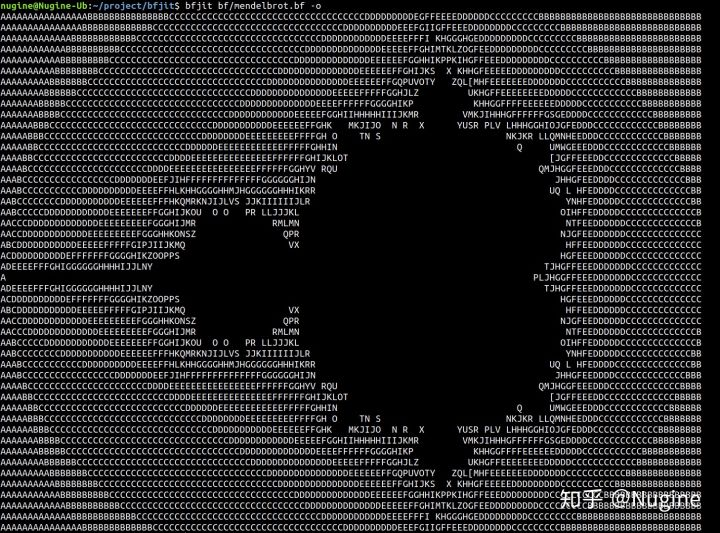
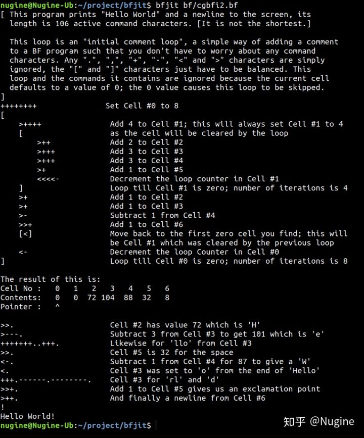
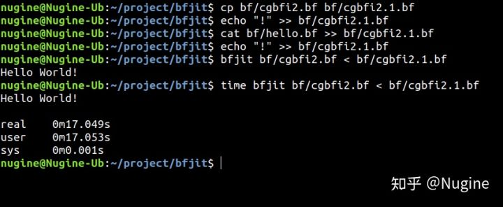
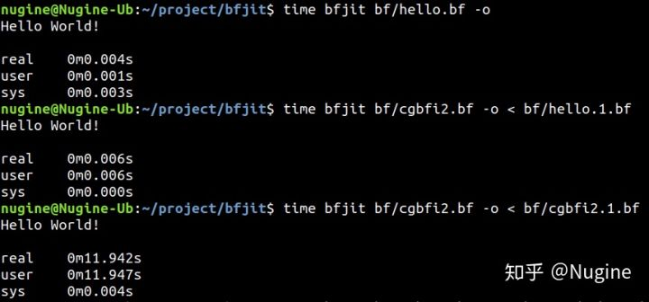

# Brainfuck JIT 虚拟机教程

我一直好奇 JIT 是如何工作的，于是查找各种资料写了一个 Brainfuck JIT 虚拟机，还把步骤总结成了教程。

<https://github.com/Nugine/bfjit>

最终可以在2秒内打印出 Mandelbrot 图像，这个速度与 AOT 的结果一致 (Brainfuck 编译到 Rust，opt-level=3)。

用 JIT 跑 Brainfuck 写的 Brainfuck解释器 跑 helloworld

用 JIT 跑 Brainfuck 写的 Brainfuck解释器 跑 Brainfuck 写的 Brainfuck 解释器 跑 helloworld 

开启简单优化，两层自解释器的 helloworld 时间从 17秒 降到 12秒。

套两层自解释器后效率严重下降，如果按倍数计算，再套一层的 helloworld 时间约为 6.7 小时。

用 Rust 写这类上到解析库下到汇编优化的东西时总有一种一致性带来的舒爽感。

Rust 过程宏几乎能把任何语法嵌进去(asm, html 等)，毕竟是编译器插件，语法非常自然。要用已有的高级库时可以一键调用，完美整合，要下到底层搞黑魔法时也有 unsafe、asm 等武器。最关键的是不用折腾，这实在是太爽了。

详细的编写步骤在教程里，欢迎 PR 和 Star.

<https://github.com/Nugine/bfjit>
