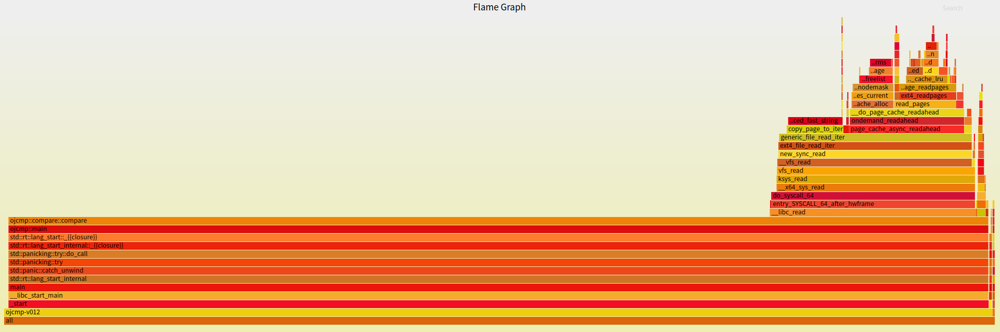
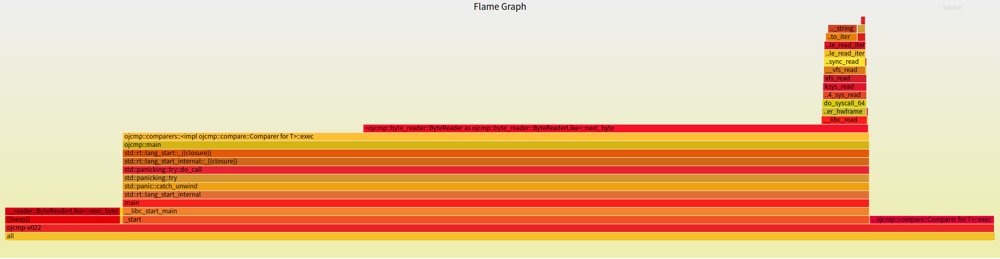
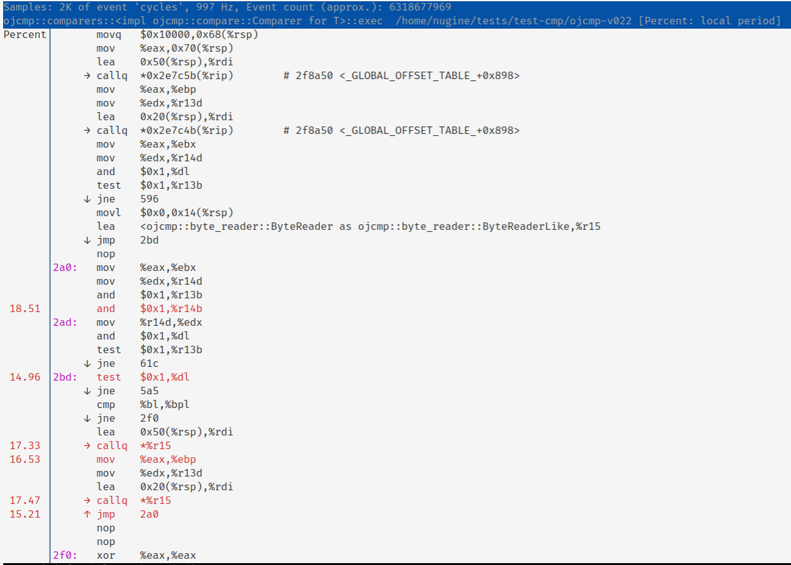
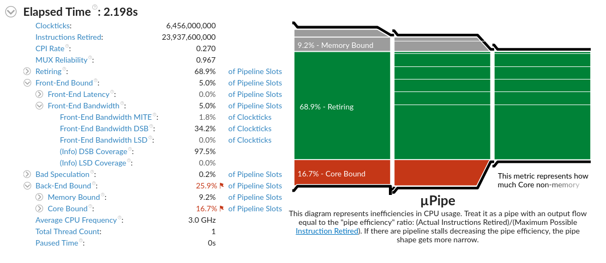
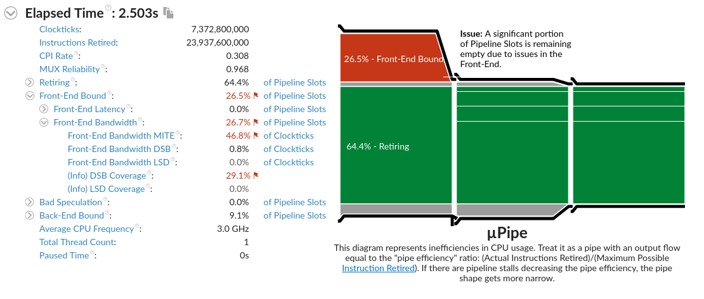

# Rust 性能调优

最近我遇到一个性能下降问题，在动用各种工具折腾到接近放弃之时，又想出一个点子，获得了最高九倍的性能提升。为此专门写一篇文章，复盘一下性能调优的历程。

## 问题背景

在 ICPC 比赛中，选手阅读题目，编写程序，提交到在线评测系统（OJ）。OJ 会编译运行选手提交的程序，选手从标准输入读取题目数据，向标准输出写入答案。

在选手程序运行完毕后，OJ 会比对选手程序输出和标准答案，如果一致，则判定为通过(Accepted/AC)，也可能格式错误(PresentationError/PE)，如果不一致，则判定为错误(WrongAnswer/WA)。

当然也有其他可能结果，比如运行时错误(RE)、超时(TLE)、内存超限(MLE)、输出超限(OLE)等。

我用 Rust 编写了一个程序 [ojcmp](https://github.com/ThinkSpiritLab/ojcmp)，用来比对选手答案和标准答案。

该项目的目标：

1. 算法正确，任何情况下都不能出错
2. 极限性能，比 diff 更快
3. 资源占用尽可能小，以免影响评测系统

核心算法的目标：

+ 时间复杂度 O(n+m)，其中 n 是选手答案的长度，m 是标准答案的长度。
+ 空间复杂度 O(1)，无论文件多大，都不会占用过多内存。

核心算法是上下文强相关的，难以并行化，就算能够并行，算法占用的 CPU 时间也不会减少，因此只能写单线程。

总结一下，需要往死里优化的就是一个纯函数，输入为两个字节流，输出为 AC/PE/WA。

## 算法正确性判定

在开始之前，要回答一个问题，什么样的选手答案可以判定为 AC/PE/WA？

我们规定：

1. 选手答案和标准答案严格相等时，一定是 AC
2. 选手答案和标准答案的末尾的空白字符不会影响判定
3. 每一行末尾的空白字符不会影响判定
4. 若某一行中，非空白字符一致，但空白字符不一致，判定为 PE
5. 若某一行中，非空白字符不一致，判定为 WA

其中“空白字符”规定为 [ASCII 空白字符](https://infra.spec.whatwg.org/#ascii-whitespace)。

举一些例子

```rust
judge!(AC, b"1\r\n\r\n\r\n", b"1  ");
judge!(AC, b"1 \n", b"1");
```

```rust
judge!(PE, b"1 3\n", b"1         3\n");
judge!(PE, b"1\r3\n", b"1\t3\n");
```

```rust
judge!(WA, b"1", b"2");
judge!(WA, b"1\r\n", b"2\n");
```

因此，核心算法应该是一个以字节为单位的状态机，大循环套小循环即可。

## 性能调优

我们跳过对核心算法的说明，直接介绍调优手段。

### 1. 回避 `io::Result`

说到字节流，我们自然会想到标准库的 `std::io::Bytes`，然而它在这里会带来严重的性能问题。

测试代码：

```rust
use std::fs::File;
use std::io::{self, BufRead, BufReader, Read};
use std::time::{Duration, Instant};

fn time<R>(f: impl FnOnce() -> R) -> (R, Duration) {
    let t0 = Instant::now();
    let ans = f();
    (ans, t0.elapsed())
}

fn test_bytes(reader: &mut impl BufRead) -> io::Result<u8> {
    let mut ans = 0;
    for byte in reader.bytes() {
        ans ^= byte?;
    }
    Ok(ans)
}

fn test_block(reader: &mut impl BufRead) -> io::Result<u8> {
    let mut ans = 0;
    loop {
        match reader.fill_buf()? {
            [] => break,
            buf => {
                buf.iter().for_each(|&byte| ans ^= byte);
                let amt = buf.len();
                reader.consume(amt);
            }
        }
    }
    Ok(ans)
}

fn main() -> io::Result<()> {
    let bytes_ret = {
        let mut reader = BufReader::new(File::open("Cargo.toml")?);
        time(|| test_bytes(&mut reader))
    };

    let block_ret = {
        let mut reader = BufReader::new(File::open("Cargo.toml")?);
        time(|| test_block(&mut reader))
    };

    let _ = dbg!(bytes_ret);
    let _ = dbg!(block_ret);

    Ok(())
}
```

测试结果：

```
[src/main.rs:45] bytes_ret = (
    Ok(
        123,
    ),
    7.064µs,
)
[src/main.rs:46] block_ret = (
    Ok(
        123,
    ),
    1.708µs,
)
```

读取一个字节流，对其中所有字节做异或，最后输出。

测试结果表明：`std::io::Bytes` 的速度远低于手动控制缓冲区。

Q: 明明计算次数都是 n，为什么速度不一致？

A: 因为 `std::io::Result<u8>` 实在是太大了。

截取 `std::io::Error` 的定义：

```rust
pub struct Error {
    repr: Repr,
}

enum Repr {
    Os(i32),
    Simple(ErrorKind),
    Custom(Box<Custom>),
}
```

其中包含了一个指针，这意味着 `std::io::Error` 在 64 位机器上是 8 字节对齐，再加枚举标签，它会达到 16 字节。

`std::io::Result<u8>` 会再套一个枚举标签，让整体达到 24 字节。

如果读取文件中的每个字节都要被迫操作 24 字节大小的内存，显然对 CPU 极度不友好，性能会非常低，。

PS: `anyhow::Error` 使用了自定义虚表，手动操控动态错误对象的布局，大小是一个指针，即 8 字节。

但核心算法以字符为单位，一定需要 `next_byte` 之类的操作，怎么回避 `Result` 过大的问题？

这里给出的解法是 try-catch

```rust
fn catch_io<R>(f: impl FnOnce() -> R + UnwindSafe) -> io::Result<R> {
    match catch_unwind(f) {
        Ok(ans) => Ok(ans),
        Err(payload) => match payload.downcast::<io::Error>() {
            Ok(e) => Err(*e),
            Err(payload) => resume_unwind(payload),
        },
    };
}
```

当出现 IO 错误时，用 `panic!(e)` 抛出错误，外层 catch IO 错误。

算法中需要判断 EOF，所以不能把 EOF 也当错误抛出。

这样就能让 `next_byte` 操作的返回值从 24 字节减小到 2 字节，一个字节表示数据，另一个表示是否 EOF。

### 2. 强制内联热点函数

ojcmp 的两个版本之间出现了高达 2 ～ 3 倍的性能差距，但算法明明是相同的。

我们可以使用火焰图观察函数耗时占比。

Rust 生态中有一个命令行工具 [flamegraph](https://github.com/flamegraph-rs/flamegraph)，能够通过 perf 收集数据生成火焰图。




差异在于后者出现了深红色的 `next_byte` 调用。

再使用 `perf annotate` 查看指令。



发现在高频循环中出现了过多函数调用，因此解法是强制内联 `next_byte`。

加上 `#[inline(always)]`，循环中确实内联了 `next_byte` 函数，后者性能提高 2 ～ 3 倍，与前者一致了。

### 3. 使用 unsafe

尝试使用 unsafe 跳过热点的数组边界检查，结果反而更慢了？？？

实测中出现这种反直觉的情况，只能说明数组边界检查的影响完全比不上其他影响因素。查看汇编也发现热点的边界检查仅占全部时钟周期的 2.5 %.

反复尝试后有了新发现：热点函数中使用裸指针代替数组索引，可以让耗时减少约三分之一。

```rust

pub struct ByteReader<R> {
    inner: R,
    buf: Box<[u8]>,
    pos: usize,
    len: usize,
}

...

fn next_byte(&mut self) -> Option<u8> {
    debug_assert!(self.len <= self.buf.len());
    if self.pos < self.len {
        let byte = self.buf[self.pos];
        self.pos += 1;
        Some(byte)
    } else {
        match self.inner.read(&mut *self.buf) {
            Ok(nread) => {
                if nread == 0 {
                    None
                } else {
                    let byte = self.buf[0];
                    self.len = nread;
                    self.pos = 1;
                    Some(byte)
                }
            }
            Err(e) => panic!(e),
        }
    }
}
```


```rust
pub struct ByteReader<R> {
    inner: R,
    buf: Box<[u8]>,
    head: *const u8,
    tail: *const u8,
}

...

fn next_byte(&mut self) -> Option<u8> {
    if self.head != self.tail {
        unsafe {
            let byte = *self.head;
            self.head = self.head.add(1);
            Some(byte)
        }
    } else {
        match self.inner.read(&mut *self.buf) {
            Ok(nread) => {
                if nread == 0 {
                    None
                } else {
                    unsafe {
                        let byte = *self.buf.as_ptr();
                        self.head = self.buf.as_ptr().add(1);
                        self.tail = self.buf.as_ptr().add(nread);
                        Some(byte)
                    }
                }
            }
            Err(e) => panic!(e),
        }
    }
}
```

然而，两种写法编译出的指令并无明显区别，真正的影响因素是什么？这个谜团留给读者。

### 4. 使用 VTune 观测微架构

尽量减小 ojcmp 两个版本之间的差异后，还是有 10% ~ 16% 左右的性能差距，但算法相同，IO 相同，已经想不到有什么因素可以影响性能了。

<https://zhuanlan.zhihu.com/p/138103106>

从这篇文章中受到启发，也许是 CPU 微架构的影响。

Intel 出了一套性能分析工具 [Intel VTune Profiler](https://software.intel.com/content/www/us/en/develop/tools/vtune-profiler.html)，可以看到微架构的执行情况。





Front-End Bandwidth MITE 和 DSB Coverage 有明显差异，说明指令在内存中的布局影响了 CPU 微指令的转换和缓存，产生性能差距。

那么我们能不能手动控制指令布局呢？

经过多次尝试，得出了一个令人遗憾的结论：无法以可接受的代价来手动控制指令布局。

在一个比较复杂的算法函数中，编译器对指令的排列是不可依赖的，稍微改变写法，或者更改编译器版本，都会让结果发生变化。

手动写内联汇编，无论从性能还是可维护性来说，都是一个最坏的选择。

### 5. 优化算法策略

深入到微架构之时，单纯的代码优化就已经到头了，看起来也不得不接受 10% 上下的性能损失，等编译器更新再看运气。

状态机是个高频循环，又对数据有强依赖，难以优化分支，想到这里，我突然冒出一个新点子，能否加上类似分支预测的算法来针对特定数据进行优化？

再回顾一下问题背景：

+ 比较选手答案与标准答案
+ 比较两个字节流
+ 以字节为单位的状态机


可以假设，有相当一部分情况下两个字节流完全相同。

#### 块比较

如果检测到相同的字节占比过大，那么两个字节流完全相同的几率很大，此时可以把两个缓冲区直接拿出来比较。

memcmp 是经过高度优化的，分块比较的效率显然更高，但需要记录相同次数和比较次数，预测失败反而有可能降低效率。

#### 短比较

在逐字节比较之前，两个字节流都向前获取 8 字节，如果相同就跳 8 个位置。

对于相同比例较大又不完全相同的情况，比如 LF 和 CRLF，这种策略会降低算法常数，有显著性能提升。

如果发现不同，又有相当大的可能性是答案错误(WA)，格式错误(PE)在真实场景中非常少。一旦 WA 了，算法就会退出，仅当 PE 时这种策略才会拖慢速度。

#### 分析

CPU 分支预测是基于分支跳转的概率，成功会有加速，失败会有惩罚。

上述两种优化策略都是基于数据分布，能有效减小算法耗时的期望，当预测失败时会降低性能，与分支预测类似。

实测性能：

+ 块比较/原版：AC 905%
+ 短比较/原版：AC 185%
+ 短比较/原版：PE 79%

块比较的策略能够带来**九倍**的性能提升。短比较加速明显，失败的惩罚也可以接受。

## 总结

优化什么？

+ 优化对象是纯函数，便于测定性能

为什么要优化？

+ 项目目标之一是极限性能

如何优化？

+ 回避 `io::Result`
+ 强制内联热点函数
+ 使用 unsafe （为什么裸指针比索引快？）
+ 使用 VTune 观测微架构
+ 优化算法策略

性能调优历程中使用的工具：

+ perf
+ flamegraph
+ VTune

未来的优化空间：

+ 扣指令细节，优化代码
+ 用 mmap、madvise、fadvise 之类的系统调用优化 IO

