# 循环队列的正确写法

## 伪代码

#### 结构定义

```cpp
typedef struct {
    uint32_t *buf;
    uint32_t cap;
    uint32_t head;
    uint32_t tail;
} ring_queue;
```

结构体里保存了所用内存的指针、容量，保存了队头和队尾。

#### 队列长度

```cpp
uint32_t rq_len(ring_queue *rq) { 
    return rq->tail - rq->head; 
}
```

队列长度直接就是 tail - head。

#### 入队操作

```cpp
void rq_push(ring_queue *rq, uint32_t value) {
    if rq_len() == cap {
        error();
    }
    rq->buf[rq->tail % rq->cap] = value;
    rq->tail += 1;
}
```

入队时首先对 tail 取模，模数为 cap，得到真实索引，然后把值写入队列空间，最后把 tail 加 1。

#### 出队操作

```cpp
uint32_t rq_pop(ring_queue *rq) {
    if rq_len() == 0 {
        error();
    }
    uint32_t value = rq->buf[rq->head % rq->cap];
    rq->head += 1;
    return value;
}
```

出队时首先对 head 取模，模数为 cap，得到真实索引，然后读取队列元素，最后把 head 加 1。

## 原理解析



如图所示，cap = 4，head = 2，tail = 5。

循环队列的空间可以认为是一条无限长的数轴，head 和 tail 是上面的数字。

[head, tail) 是左闭右开的区间，区间长度是队列长度，其中的数字代表队列元素。图中的区间 [2, 5) 中有 2,3,4 三个数字，也就代表队列元素有 3 个。

对数字取模可以得到队列元素在队列空间中的位置，2,3,4 对应的位置是 2,3,0。

无限次入队出队后，head 和 tail 会非常大，有可能溢出 uint32_t 类型的最大值。但队列在这种情况下仍然能正常工作。`tail - head` 会自然溢出，相当于取模 M，其中 M 为 $2^{32}$。只要保证队列长度小于 M，`tail - head` 得到的就是真正的队列长度。

当 cap 为 2 的幂时，有 `x % cap == x & (cap - 1)`，可以用位运算取代消耗较大的模运算。

相比常见的实现，这种写法不需要额外记录队列长度，也不需要浪费一个元素的空间，还能轻易改造成无锁循环队列。这也是 Linux 内核中 kfifo 结构所使用的写法。
