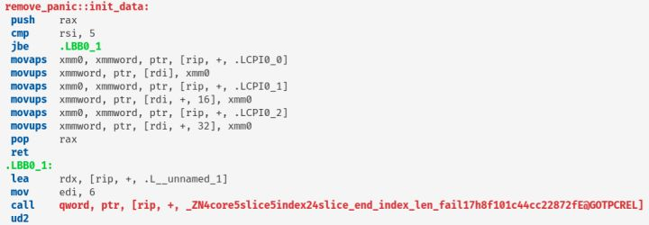
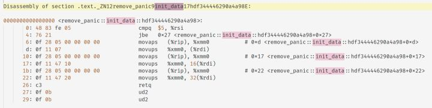

# Rust 消除 panic 代码膨胀

Rust 提供了一个不稳定功能 panic_immediate_abort，在 panic 时立即终止进程，以这种方式编译可以消除相当一部分代码膨胀。

用 cargo 新建项目，测试名称是 remove_panic

```bash
cargo new --lib remove_panic
```

测试函数

```rust
pub fn init_data(slice: &mut [usize]) {
    let s = &mut slice[..6];
    s[0] = 4;
    s[1] = 4;
    s[2] = 5;
    s[3] = 6;
    s[4] = 7;
    s[5] = 5;
}
```

以 release 模式编译

```bash
cargo build --release
```

用 cargo asm 工具查看汇编

```bash
cargo asm -- remove_panic::init_data
```



此时函数中包含 panic 相关代码。

我们用 panic_immediate_abort 参数编译

```bash
cargo +nightly \
    -Z build-std=std,panic_abort \
    -Z build-std-features=panic_immediate_abort \
    build --release \
    --target x86_64-unknown-linux-gnu  
```

找到目标文件，用 rust-objdump 工具将汇编输出到文本文件

```bash
cd target/x86_64-unknown-linux-gnu/release/
rust-objdump --demangle --disassemble-all libremove_panic.rlib > out
```

在文本文件中搜素 init_data 符号，找到函数



函数中的 panic 相关代码已被移除，替换成 ud2，以 CPU 非法指令异常让进程终止。这种优化在 wasm、嵌入式代码中也适用。

总结，目前 Rust 有三种 panic 策略：

+ unwind：运行 panic 钩子，进行异常展开。提供异常恢复。
+ abort：运行panic 钩子，终止
+ immediate_abort：立即终止（不稳定功能）

使用不同策略编译可能会得到不同的程序行为和代码体积。
