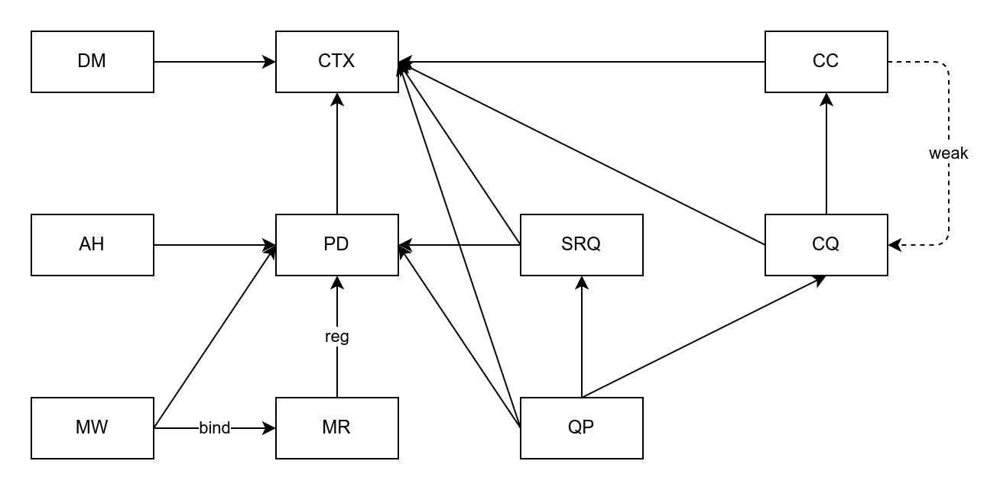

# 如何在 Rust 中写 RDMA

远程直接内存访问 (RDMA) 是一种允许计算机之间通过网络直接访问对方内存的技术，操作系统能够把数据传输开销卸载到特殊网卡上，从而实现高吞吐、低延迟的网络通信。

RDMA 的主要优势有：

1. 零拷贝 (zero-copy)：省去了用户空间和内核空间之间的数据复制，要传输的数据可以被直接“放置”到目标内存地址。

2. 内核旁路 (kernal bypass)：传输过程可以绕过内核，省去了系统调用和上下文切换的开销。

3. 硬件卸载：由支持 RDMA 的特殊网卡来完成封包解包，省去了 CPU 计算开销。

RDMA 的主要劣势有：

1. 编程范式相比传统网络通信变化过大，应用需要专门适配。

2. 特殊网卡较为昂贵，不适合普通人使用。

由于 RDMA 涉及各种复杂的异步内存操作，在 Rust 中写 RDMA 要格外注意内存安全性。要想将 RDMA 软件栈封装为安全的网络库，需要解决两个问题：

1. RDMA 资源管理
2. RDMA 内存管理

## RDMA 资源管理

知乎上已经有了详细的 RDMA 学习资料，读者可以先去花一两个小时过一遍。

<https://zhuanlan.zhihu.com/p/164908617>

RDMA 资源是用于完成 RDMA 操作的一系列对象，表示软硬件协议栈中的各种实体。资源之间有引用关系，如果释放资源的顺序违反了引用关系，轻则报错，重则出现安全漏洞。

梳理资源引用关系后，可以画出这样一张引用图：



+ CTX：设备上下文，Context，用于调用硬件
+ PD：保护域，Protection Domain，用于隔离资源
+ MR：内存区域，Memory Region，用于 RDMA 内存操作
+ DM：设备内存，Device Memory，表示硬件上的存储空间
+ AH：地址句柄，Address Handle，表示网络节点的通信地址
+ MW：内存窗口，Memory Window，表示 MR 的子区域，具有单独的控制方法
+ CC：完成事件通道，Completion Event Channel，是RDMA 软件栈向应用发送完成事件通知的通道
+ CQ：完成队列，Completion Queue，应用从完成队列中获取完成队列项，每个完成队列项表示一个异步操作完成。
+ SRQ：共享接收队列，Shared Receive Queue，多个 QP 可以共享相同的接收队列，以节省空间。
+ QP：队列对，Queue Pair，包含发送队列和接收队列，是 RDMA 通信的基本单元。

图中方框表示 RDMA 资源，实线箭头表示强引用，虚线箭头表示弱引用，实线箭头与方框组成有向无环图，释放资源的顺序必须是这个有向无环图的一个拓扑序列。

因此可以用原子性引用计数指针来管理资源，在 Rust 中强引用对应 Arc，弱引用对应 Weak，在创建和销毁资源时维护好相关资源的引用计数即可。

另一种方法是通过一个统一的容器来管理资源，与引用计数方案相比互有优劣。本文认为引用计数方案更灵活一些，易于实现，在没有特殊需求的情况下，应当首选引用计数。

## RDMA 内存管理

解决资源管理后，再来看内存管理。RDMA 的异步内存操作其实与 io uring 很像，是典型的 Proactor，《[关于 io_uring 与 Rust 的思考](./../../../2021/02/io_uring_and_rust/index.md)》中描述过相关问题。

普通内存需要在 RDMA 协议栈中进行注册，成为 RDMA 内存区域 (MR)。内核会为 MR 锁页，阻止物理地址和虚拟地址的映射发生变化。协议栈会设置 MR 的访问权限，为 MR 分配本地密钥 (lkey) 和远程密钥 (rkey)，用于在内存操作时提供保护。

在 RDMA 异步内存操作过程中，一段内存可能被应用、协议栈、硬件访问，可能被本地或远程访问，其中有可能出现三类问题：

1. 释放后使用 (UAF)：操作未完成时，内存被解除注册或解除分配
2. 本地读写竞争：一段内存被同时读写，或被同时写入
3. 本地远程竞争：一段内存被本地节点和远程节点同时读写，或被同时写入

### 访问权

我们可以借助访问权限的思想来抽象内存：

```rust
pub unsafe trait LocalAccess {
    fn addr_u64(&self) -> u64;
    fn length(&self) -> usize;
    fn lkey(&self) -> u32;
}
pub unsafe trait LocalReadAccess: LocalAccess {}
pub unsafe trait LocalWriteAccess: LocalAccess {}
```

`LocalAccess` 抽象了本地内存区域的三个要素：地址、长度、本地密钥，表示本地内存区域的访问权。`unsafe trait` 表示这个 trait 可以信任，unsafe 操作可以假设其中的方法返回值都有效。

本地内存区域的访问权进一步划分为本地读取权和本地写入权，与 RDMA 的访问权限相对应。

```rust
pub unsafe trait RemoteAccess {
    fn addr_u64(&self) -> u64;
    fn length(&self) -> usize;
    fn rkey(&self) -> u32;
}
pub unsafe trait RemoteReadAccess: RemoteAccess {}
pub unsafe trait RemoteWriteAccess: RemoteAccess {}
```

远程内存区域也一样，区别仅在于远程密钥。

当执行异步操作时，需要向异步运行时传递一段或多段内存的**读取权**或**写入权**，统称为**访问权**。

异步运行时在操作完成后才会释放或返还访问权，在访问权存活期间，它所指向的所有内存必须有效，并保证同一时刻不存在相互竞争的访问权，例如读-写竞争和写-写竞争。这一安全约束解决了上述三类问题。

### 什么类型才能表示访问权

为了方便理解，我们用一个虚构的泛型类型 `Reg<T>` 来表示已注册的 RDMA 内存类型。

第一个：

```rust
Reg<Box<[u8]>>
```

它表示一段内存的**唯一所有权**。在它存活期间，内存有效，不可能存在竞争。因此它可以同时表示读取权、写入权。

第二个：

```rust
Reg<Arc<[u8]>>
```
 
它表示一段内存的**共享所有权**。在它存活期间，内存有效，由于 `Arc<T>` 不可变，也不可能存在写入竞争。因此它可以表示读取权。

第三个： 

```rust
Reg<Box<[MaybeUninit<u8>]>>
```

它表示一段**未初始化**内存的唯一所有权。在它存活期间，内存有效，无竞争，但不能读取，只能写入。因此它可以表示写入权。

第四个：

```rust
(
    Reg<Arc<RwLock<Vec<u8>>>>, 
    OwnedRwLockReadGuard<Vec<u8>>
)
```

这是一个二元组，前者表示一段内存的共享所有权，后者表示**读写锁的读取保护**。在它存活期间，内存有效，有锁保护，无竞争，可读取，但不可写入。因此它可以表示读取权。

第五个： 

```rust
(
    Reg<Arc<RwLock<Vec<u8>>>>, 
    OwnedRwLockWriteGuard<Vec<u8>>
)
```

与第四个类似，区别是换成了**读写锁的写入保护**，它可以同时表示读取权、写入权。

### 访问权的组合

将多个访问权组合起来，就可以访问多段不相关的内存。在 RDMA 里表示为分散/收集列表 (sg list)。用 trait 来表示：

```rust
pub unsafe trait ScatterList {
    fn length(&self) -> usize;
    unsafe fn fill(&self, ptr: *mut Sge);
}
pub unsafe trait GatherList {
    fn length(&self) -> usize;
    unsafe fn fill(&self, ptr: *mut Sge);
}
pub trait IntoScatterList {
    type Output: ScatterList;
    fn into_scatter_list(self) -> Self::Output;
}
pub trait IntoGatherList {
    type Output: GatherList;
    fn into_gather_list(self) -> Self::Output;
}
```

可以为单个访问权或访问权的数组实现 sg list 的 trait，符合要求的还有很多类型，不过多展示了。

```rust
unsafe impl<T, const N: usize> ScatterList for [T; N]
where
    T: LocalReadAccess,
{ ... }

unsafe impl<T, const N: usize> GatherList for [T; N]
where
    T: LocalWriteAccess,
{ ... }

unsafe impl<T> ScatterList for T
where
    T: LocalReadAccess,
{ ... }

unsafe impl<T> GatherList for T
where
    T: LocalWriteAccess,
{ ... }


impl<T: ScatterList> IntoScatterList for T {
    type Output = T;

    fn into_scatter_list(self) -> Self::Output {
        self
    }
}

impl<T: GatherList> IntoGatherList for T {
    type Output = T;

    fn into_gather_list(self) -> Self::Output {
        self
    }
}
```

至此，我们把 RDMA 内存管理的安全约束表示为访问权，访问权分为读取权和写入权，各类型根据自身性质实现读取权或写入权。在执行操作前，向异步运行时传递访问权，异步运行时完成操作后释放或返还访问权。这就完成了安全抽象，允许应用在禁止 unsafe 代码的情况下编写 RDMA 通信。

这套访问权抽象机制也适用于任意 Proactor，例如 io uring。相比所有权传递机制的改进在于，明确区分了访问权与所有权，安全约束更清晰，允许 API 设计者通过读写锁等保护方法把 Proactor 伪装成 Reactor。

## 总结

为了满足在 Rust 中写 RDMA 的安全需求，本文分析了两个 RDMA 管理问题：

1. RDMA 资源管理：通过有向无环图和引用计数解决
2. RDMA 内存管理：通过访问权抽象解决

本文的解决方案具有普适性，不仅适用于 RDMA，也适用于其他场景。希望能给读者带来启发。

最后推广一下我的低层 RDMA 库，求一波 star。

<https://github.com/Nugine/rdma>
