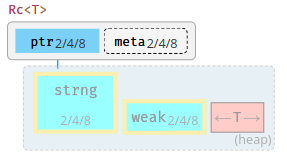
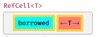

# 写 Rust 二叉树题的正确姿势

LeetCode 为 Rust 给出的二叉树定义非常令人难受，可以说既不适合练习算法，也不适合工程实践。本文将介绍一种解除安全限制的方法，能够更方便地通过 Rust 二叉树算法题。

LeetCode 的在线环境是可以运行任意代码的隔离沙箱，即使写出各种未定义行为，也不会影响到其服务的稳定性。Rust 的内存安全特性在刷题时反而显得束手束脚。

默认给出的二叉树定义如下：

```rust
pub struct TreeNode {
    pub val: i32,
    pub left: Option<Rc<RefCell<TreeNode>>>,
    pub right: Option<Rc<RefCell<TreeNode>>>,
}
```

其中 Option 代表可能为空，Rc 代表共享所有权，RefCell 代表运行时检查的可变性，组合起来就相当于有 GC 语言中的共享可变数据类型。

`Option<Rc<T>>` 可以应用非空指针优化，大小与 `Rc<T>` 相同。

对于定长类型，Rc 是一个 usize 大小的非空指针，指向堆上分配的 RcBox。RcBox 中的字段保证按 strong, weak, value 排列。



`RefCell<T>` 的布局是一个 usize 大小的借用标记加上 T 本身，不保证顺序。



因此 `Option<Rc<RefCell<TreeNode>>>` 实际上是一个 usize 大小的指针，指向堆上分配的 `RcBox<RefCell<TreeNode>>`。

把各字段展开，就可以写出这个结构的布局。

```rust
struct RawNode {
    strong: Cell<usize>,
    weak: Cell<usize>,
    borrow: Cell<usize>,
    value: i32,
    left: *mut RawNode,
    right: *mut RawNode,
}
```

但 rustc 有可能重排结构字段，不能保证顺序稳定。通过指针地址或调试器分析，可以观察到当前编译器给出的实际布局。

本文写作时确定的布局如下，编译器将 value 字段重排到了末尾。

```rust
#[repr(C)]
struct RawNode {
    strong: Cell<usize>,
    weak: Cell<usize>,
    borrow: Cell<usize>,
    left: *mut RawNode,
    right: *mut RawNode,
    value: i32,
}
```

接下来，将 `Option<Rc<RefCell<TreeNode>>>` 强转为 `*mut RawNode`，相当于把 `RcBox<RefCell<TreeNode>>` 投影为 `RawNode` 并暴露出来。然后即可通过指针任意操作二叉树了。

```rust
impl Solution {
    pub fn preorder_traversal(root: Option<Rc<RefCell<TreeNode>>>) -> Vec<i32> {
        let mut ans = Vec::with_capacity(128);
        unsafe {
            let root: *mut RawNode = transmute(root);
            if root.is_null().not() {
                Self::preorder_traversal_raw(root, &mut ans);
            }
        }
        ans
    }

    unsafe fn preorder_traversal_raw(root: *mut RawNode, ans: &mut Vec<i32>) {
        let (val, left, right) = read_node(root);

        ans.push(val);

        if left.is_null().not() {
            Self::preorder_traversal_raw(left, ans);
        }
        if right.is_null().not() {
            Self::preorder_traversal_raw(right, ans);
        }
    }
}
```

相比折腾 Rc 和 RefCell，用 Unsafe Rust 写的二叉树前序遍历基本上直接对应抽象算法，没有冗余噪音。

在写其他会修改二叉树的题目时，有可能需要改变引用计数，这时可以将 strong 和 weak 修改为一个巨大的数值，故意制造内存泄露，以通过 LeetCode 的检查。

要点总结：

+ 分析并确定 Rust 数据结构布局
+ **通过结构投影解除安全限制**
+ 用 Unsafe Rust 编写算法
+ 必要时“欺骗” LeetCode
+ **请勿在实际工程中使用这种方法**
