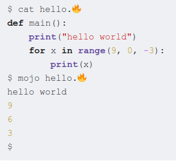

# Mojo 编程语言

知乎回答：[如何看待 Modular 提出的 mojo 语言？](https://www.zhihu.com/question/598832787/answer/3013077756)

---

虽然我的第一反应是 xkcd 927[^1]，但还是快速看了一遍 Mojo 编程语言的手册[^2]，这里从编程语言的角度说说几个有意思的地方。


[^1]: https://xkcd.com/927/
[^2]: https://docs.modular.com/mojo/programming-manual.html

#### 文件扩展名

Mojo 编程语言的文件扩展名是 `mojo` 或 `🔥`。

是的，你没有看错，它的扩展名可以是一个 emoji。不觉得很酷吗（狗头）。



#### 系统编程扩展

Mojo 编程语言的语法是 Python 的**超集**，添加了用于系统编程的扩展语法。

+ `let` 声明不可变变量，`var` 声明可变变量
+ 支持变量遮蔽 (name shadowing)
+ `struct` 类型
+ 强类型检查
+ 重载函数和方法
+ `fn` 函数
+ 特殊的魔术方法
+ 编译期元编程：参数化类型和函数

#### 编译期元编程

Mojo 的 `struct` 类型相当于编译期完成绑定的 Python `class`。

Mojo 利用 Python 的 type hint 语法支持强类型检查，属于渐进类型系统。

Mojo 能够编译期求值，加上类型标注，可以说已经具有实用的泛型能力。

示例：

```python
struct SIMD[type: DType, size: Int]:
    ...
    fn reduce_add(self) -> SIMD[type, 1]:
        @parameter
        if size == 1:
            return self[0]
        elif size == 2:
            return self[0] + self[1]

        # Extract the top/bottom halves, add them, sum the elements.
        let lhs = self.slice[size // 2](0)
        let rhs = self.slice[size // 2](size // 2)
        return (lhs + rhs).reduce_add()
```

#### 特殊的魔术方法

Mojo 支持值语义，还对一些魔术方法进行特殊处理，例如：

+ `__init__`: 构造函数
+ `__del__`: 析构函数
+ `__copyinit__`: 拷贝构造函数
+ `__moveinit__`: 移动构造函数

后两个绝对来自于 C++，但 Mojo 砍了拷贝赋值函数和移动赋值函数。

有了这些，你可以写出

+ 无法实例化的类型
+ 不可移动类型和不可复制类型
+ 仅可移动的类型
+ 支持非破坏性移动的类型
+ 可复制类型
+ 平凡值类型
+ 值类型 (相当于 dataclass)

示例：

```python
struct MyString:
    var data: Pointer[Int8]

    # StringRef has a data + length field
    def __init__(self&, input: StringRef):
        let data = Pointer[Int8].alloc(input.length+1)
        data.memcpy(first.data, input.length)
        data[input.length] = 0
        self.data = Pointer[Int8](data)

    def __del__(owned self):
        self.data.free()
```

Mojo 的析构函数会在对象最后一次使用后立即调用，用原文的话说就是 “As Soon As Possible”，这直接导致基于作用域的 C++ RAII 模式不可用。不过反正 Python 有 `with`，也没什么大不了的。

给 Python 社区一点小小的 C++ 震撼 （狗头）。

#### 所有权和借用检查

Mojo 有类似 Rust 的所有权和借用检查，会追踪变量的使用情况，禁止“消耗后使用”，禁止多个可变引用，禁止无效的可变引用。

调用函数时默认传递引用，也可以通过 `^` 操作符传递所有权。

```rust
fn usePointer():
    let ptr = SomeUniquePtr(...)
    use(ptr)        # Perfectly fine to pass to borrowing function.
    use(ptr)
    take_ptr(ptr^)  # pass ownership of the `ptr` value to another function.

    use(ptr) # ERROR: ptr is no longer valid here!
```

根据手册，Mojo 的借用检查器、生存期分析还未启用，处于 TODO 状态，有关生存期的语法还没有引入。

我比较怀疑 Mojo 能否成功把这个特性和 Python 语法放到一起，毕竟 Rust 这套系统对来自动态语言的初学者相当不友好。

#### 性能

Mojo 基于 MLIR，通过暴露一些基本类型和裸指针，允许用户实现与原生代码相当的性能，对 SIMD 、张量和异构计算有更好的支持。

Python 实在是太慢了，以至于任何一个设计良好的方言加上编译器就能吊打它。Mojo 声称的 35000 倍加速对 AI 用户可能没什么实际意义，因为性能敏感的地方早就被框架换成 C/C++ 了。别人也在用编译器，Mojo 不会拉出代差。

### 结论

Mojo 的设计思路是作为 Python 超集再加上系统编程支持，通过 MLIR 扩展到不同硬件架构，以此实现统一 AI 的目标。

Mojo 想要组合 Python 的易用性和 C 的性能，但搞不好会变成 Python 的速度和 C++ 的复杂度，再加上 Rust 的所有权、生存期和借用检查，可能会碰到编程语言设计上的大坑。

个人看法：目前的 Mojo 不是一个值得学习的通用编程语言，在未来的数年内，它更有可能作为一种小众 DSL 存在。
