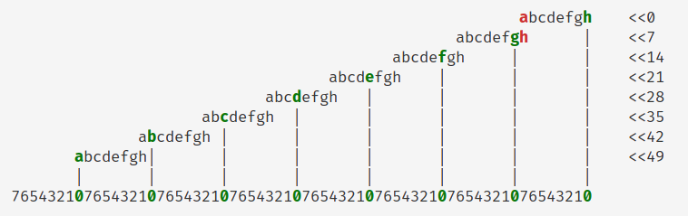
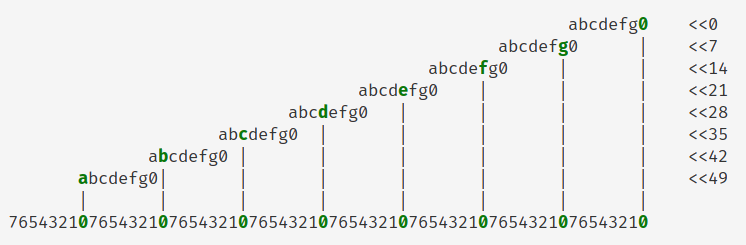
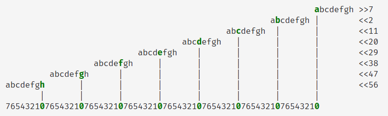

# u8 转换为比特位数组的位运算实现

前情提要：<https://zhuanlan.zhihu.com/p/390624822>

我在评论区中提到了一种位运算解法，但“这里地方太小”，写不下具体解析。最近想起来这件事，于是详细写一下思路。

## 问题定义

函数声明

```rust
pub fn bitarray(x: u8) -> [u8; 8]
```

使用方法

```rust
// 114 == 0b_0111_0010
assert_eq!(bitarray(114), [0, 1, 1, 1, 0, 0, 1, 0]);
```

该函数把一个 u8 转换为一个长度为 8 的数组，数组中的每个元素都是 `0` 或 `1`，顺序为 u8 的高位到低位。

方便起见，我们把 u8 的二进制表示为 `abcdefgh`，把函数输出称为“比特位数组”，数组内容为 `[a, b, c, d, e, f, g, h]`。

## 一般解法

显然，一般解法是利用逻辑右移和与运算，逐个取出 u8 的每一位。

```rust
pub fn bitarray_naive(x: u8) -> [u8; 8] {
    let a = x >> 7;
    let b = (x >> 6) & 1;
    let c = (x >> 5) & 1;
    let d = (x >> 4) & 1;
    let e = (x >> 3) & 1;
    let f = (x >> 2) & 1;
    let g = (x >> 1) & 1;
    let h = x & 1;
    [a, b, c, d, e, f, g, h]
}
```

但这种实现包含 7 次移位和 7 次与运算，性能不够理想。

有没有什么“奇技淫巧”可以用来加速呢？

## 特殊解法

IceBear 的文章中主要使用 SIMD 和特殊指令，是寻求加速的通用思路。但针对我们要解决的这个问题来说，还有另一种方法。

### 二进制乘法


将两个非负整数 $a$ 和 $b$ 相乘，用二进制乘法表示。

设两个非负整数的二进制位数都为 $n$，不足补前导零。

记 $b$ 的二进制表示为 $b_n b_{n-1} \cdots b_1 b_0$，则有

$$
ab = \sum_{i=0}^n (a \cdot b_i 2^i)
$$

由于 $b_i$ 只能取 $0$ 或 $1$，乘 $2^i$ 相当于左移 $i$ 位，因此二进制乘法可以转换为至多 $n$ 次左移和加法。

举个例子，8 位无符号整数 abcdefgh 与 9 位无符号整数 100000001 相乘，相当于将左移 8 位和左移 0 位的结果相加。

```
        abcdefgh    <<0
abcdefgh            <<8
----------------
abcdefghabcdefgh
```

这就是利用二进制乘法完成位操作的原理。

### 乘法与掩码

尝试用 64 位二进制乘法将 8 位无符号整数 abcdefgh 的对应比特位放到合适的位置上



实现该效果的乘数为 m = 0x0002040810204081。

注意到 a 和 h 有可能相加产生进位，改变结果中 g 的值，因此需要先去掉 h，用与运算置 0。



再用掩码 M = 0x0101010101010101 清除不需要的比特位，就得到了最终结果。

```
0000000a 0000000b 0000000c 0000000d 0000000e 0000000f 0000000g 0000000h
```

表达式为

```
y = (((x & 0xfe) * m) | x) & M
```

其中输入 $x$ 是 8 位无符号整数，输出 $y$ 是 64 位无符号整数，$y$ 的大端表示恰好是我们想要的比特位数组。

### 小端表示

输出 $y$ 在小端机器上刚好相反，在乘法时需要反转顺序。

乘法完成后还缺少最低位的 a，通过移位和或运算补上。



实现该效果的乘数为 m = 0x0102040810204080。

表达式为

```
y = ((x * m)|(x >> 7)) & M
```

### 代码

```rust
fn u64(x: u8) -> u64 {
    x as u64
}

const M: u64 = 0x0101010101010101;

// abcdefgh
pub fn bitarray_ge(x: u8) -> [u8; 8] {
    let m: u64 = 0x0002040810204081;
    let y = ((u64(x & 0xfe) * m) | u64(x)) & M;
    y.to_ne_bytes()
}

// hgfedcba
pub fn bitarray_le(x: u8) -> [u8; 8] {
    let m: u64 = 0x0100804020100804;
    let y = ((u64(x) * m) | u64(x >> 7)) & M;
    y.to_ne_bytes()
}

pub fn bitarray(x: u8) -> [u8; 8] {
    #[cfg(target_endian = "big")]
    return bitarray_ge(x);

    #[cfg(target_endian = "little")]
    return bitarray_le(x);
}
```

跑一个全值域测试，可以确定算法正确。

```rust
fn main() {
    for x in 0..=255 {
        let mut ge = bitarray_ge(x);
        let le = bitarray_le(x);
        let naive = bitarray_naive(x);

        ge.reverse();

        assert_eq!(ge, naive);
        assert_eq!(le, naive);
        assert_eq!(bitarray(x), naive);
    }
}
```

完整代码：<https://play.rust-lang.org/?version=stable&mode=debug&edition=2021&gist=2833cd2c6e04594190a106847b007bd0>

## 总结

本文介绍了一种实现 u8 转换为比特位数组的位运算方法，仅用 1 次 64 位乘法和 3 次位运算，相比一般解法有较大的性能提升。

这种特殊解法利用二进制乘法的性质来实现移位叠加，也是位运算的常用技巧之一，可以迁移到其他问题。
